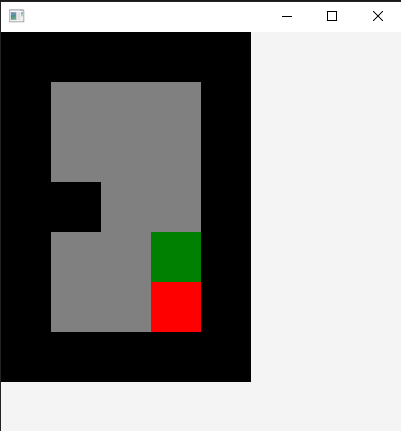
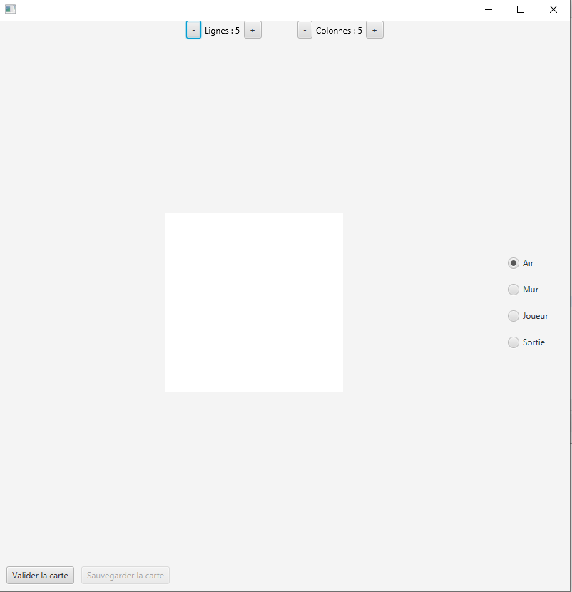
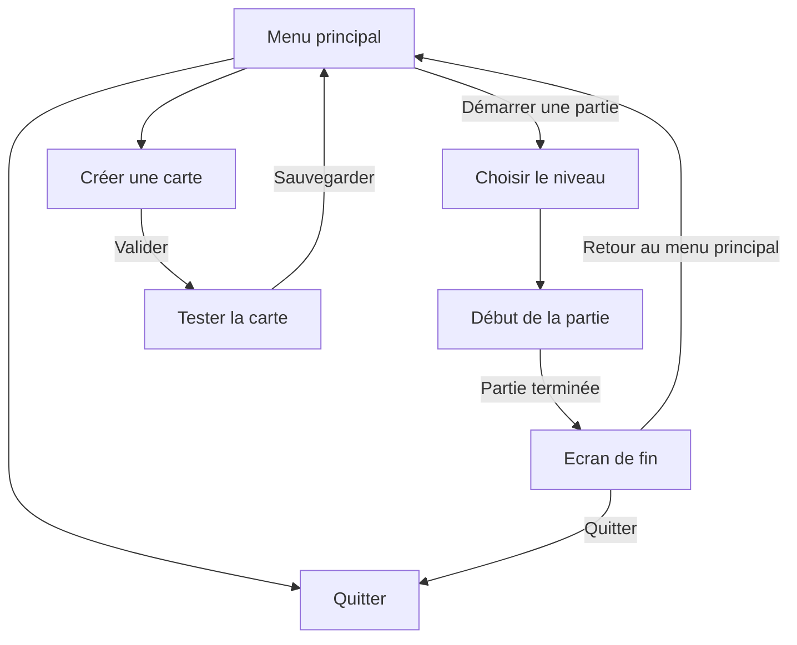

# 

Vous devez réaliser un jeu ainsi que l'éditeur de carte qui va avec.

## Le jeu 
Le but du jeu est de faire en sorte que votre carré rejoigne la sortie. Pour cela, il peut se déplacer en haut, en bas, a droite et à gauche. En revanche, lors de ses déplacements il ne peut pas s'arrêter avant d'avoir toucher un mur

;

Le joueur est représenté en rouge et la sortie en vert. Les murs sont noirs et la zone de déplacement est grise.

## L'éditeur de carte

L'éditeur doit permettre de créer sa propre carte. Le nombre de colonnes et de ligne de la carte doit être modifiable.
L'utilisateur doit également pouvoir choisir le type de cellule qu'il veut mettre (air, mur, joueur, sortie)

Lorsque l'on ajoute ou retire une colonne ou une ligne, il faut garder autant que possible ce que était déjà sur la carte et ne pas refaire une carte complètement depuis zéro.

La carte doit faire au moins 3 * 3.

Il faut cliquer sur les cases de la griller pour modifier son type.

Une fois la carte prête, elle doit être validée par le joueur. La première étape de la validation est de vérifier qu'il n'y a qu'un seul joueur sur le carte

Ensuite, la carte doit être ouverte dans une fenêtre différente et doit être jouée pour vérifier qu'elle peut bien être terminée.

Si le joueur réussi à terminer la carte, la fenêtre se ferme automatiquement et le bouton "Sauvegarder" devient cliquable. Lorsque l'on clique sur le bouton sauvegarder, la carte est sauvegardée en mémoire et le joueur est renvoyé à l'écran d'accueil.

Si le joueur ne réussit pas à terminer la carte, il peut à tout moment fermer la fenêtre de jeu et continuer l'édition de la carte.

## Ce que vous devez faire

- Réalisation du jeu
- Création d'un éditeur de carte
- Menu principal

## Organisation des menus 

## Grille de notation

| Item | Points | Description |
| ------- | ------ | ----------- |
| Respect de l'énnocé | 10 | Toutes les fonctionnalités demandées dans l'énnoncé sont présentes dans votre programme |
| Jouabilité | 20  | Le jeu est fonctionnel |
| Niveaux | 10     | Réaliser 4 niveaux de difficultés différentes : facile, moyen, difficile, extrême |
| Editeur de carte | 20 | L'éditeur de carte est fonctionnel |
| Modularité et structure | 15 | Votre code est modulaire càd qu'il peut facilement être réutilisé à plusieurs endroits. Pas de copié / collé de parties de code. Vous essayez de garder vos fonctions assez courtes (50 lignes max) pour qu'elles restent facilement compréhensibles
| JavaDoc | 15 | La javadoc est écrite pour toutes les fonctions et **complète**. -5 points pour chaque JavaDoc manquante / incomplète |
| Navigation | 5 | Il est facile de naviguer entre les différents menus du jeu |
| Github  | 5      | Dépôt sur Github de la totalité de votre projet. Je dois pouvoir lancer le projet sans aucun problème après l'avoir cloné sur ma machine |